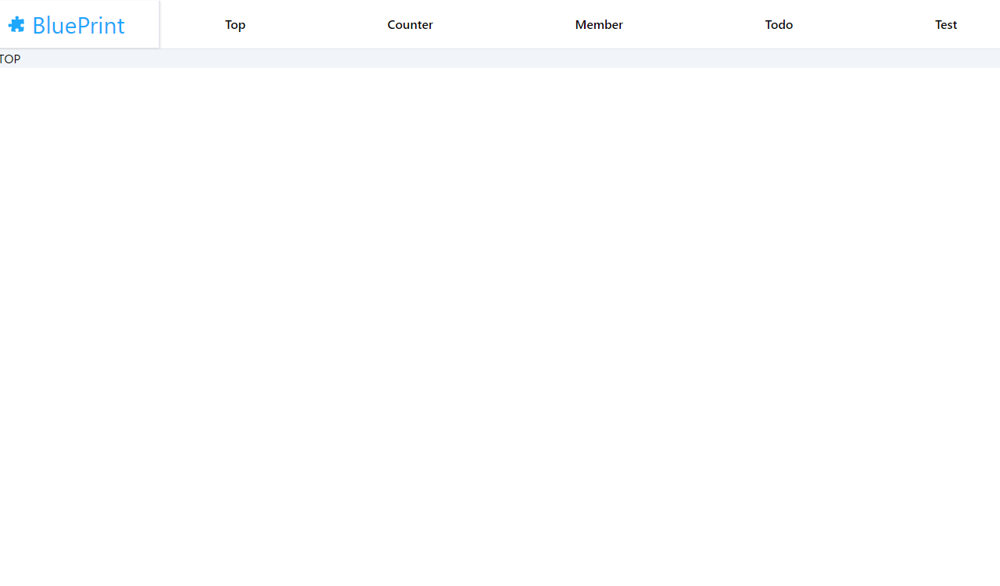

# リファレンス
## 導入
### React TypeScript
```
npx create-react-app ./ --template typescript
```

### Test
- @testing-library/jest-dom
- @testing-library/react
- @testing-library/user-event
- @testing-library/dom
- jest-environment-jsdom
- axios-mock-adapter
  
```
# jest.config.js
module.exports = {
    testEnvironment: "jest-environment-jsdom",
}
```

# jestのEM６対応
```
yarn add @babel/preset-react @babel/preset-typescript babel-jest -D
```
```
#.babelrc
{
  "presets": [
    "@babel/preset-env",
    "@babel/preset-react",
    "@babel/preset-typescript"
  ]
}
```
```
#jest.config.js
module.exports = {
  transform: {
    '^.+\\.tsx?$': 'babel-jest',
  },
  moduleFileExtensions: ['ts', 'tsx', 'js', 'jsx'],
};
```
### Yarnへの切り替え
1. package.jsonのlockファイルを削除
2. 以下を実施。
   ```
   yarn install
   ```
### webpack
```
# Webpack導入
yarn add --dev webpack webpack-cli html-webpack-plugin webpack-merge
```
```
# CSS関連ローダー導入
yarn add --dev  mini-css-extract-plugin css-minimizer-webpack-plugin css-loader postcss postcss-loader autoprefixer
```
```
yarn add --dev ts-loader
```
```
# webpack.config
const path = require('path');
const MiniCssExtractPlugin = require('mini-css-extract-plugin');
const CssMinimizerPlugin = require('css-minimizer-webpack-plugin');
const HtmlWebpckPlugin = require('html-webpack-plugin');


module.exports = {
    mode: 'development',
    entry: './src/index.tsx',
    output: {
        filename: 'bundle.js',
        path: path.resolve(__dirname, 'public/js'),
    },
    resolve: {
        extensions: ['.tsx', '.ts', '.js', 'jsx', '.css', '.json'],
    },
    plugins: [
        //　htmlにバンドルしたjavascriptとCSSをセットする
        new HtmlWebpckPlugin({
            template: './public/index.html',
            filename: '../index.html'
        }),
        new MiniCssExtractPlugin({
            filename: '../css/style.css',
        })
    ],
    module: {
        rules: [
            {
                test: /\.tsx?$/,
                use: 'ts-loader',
                exclude: /node_modules/,
            },
            {
                test: /\.css$/i,
                use: [MiniCssExtractPlugin.loader, 'css-loader', 'postcss-loader'],
            }
        ]
    },
    optimization: {
        minimizer: [new CssMinimizerPlugin()],
    }
};
```
```
# tsconfig
{
  "compilerOptions": {
    "target": "es5",
    "baseUrl": "./",
    "paths": {
      "*": ["node_modules/*"]
    },
    "lib": [
      "dom",
      "dom.iterable",
      "esnext"
    ],
    "allowJs": true,
    "skipLibCheck": true,
    "esModuleInterop": true,
    "allowSyntheticDefaultImports": true,
    "strict": true,
    "forceConsistentCasingInFileNames": true,
    "noFallthroughCasesInSwitch": true,
    "module": "esnext",
    "moduleResolution": "node",
    "resolveJsonModule": true,
    "isolatedModules": true,
    "noEmit": false,
    "jsx": "react-jsx"
  },
  "include": [
    "src"
  ]
}

```

### Redux
```
yarn add redux react-redux typescript-fsa typescript-fsa-reducers 
```
```
yarn add @reduxjs/toolkit
```

### react-router-dom
```
yarn add react-router-dom
```

### tailWindcss
```
yarn add tailwindcss -D
```
```
yarn add semver
```
```
npx tailwindcss init
```
```
// index.css
@tailwind base;
@tailwind components;
@tailwind utilities;
```
```
// tailwindcss.config.js
/** @type {import('tailwindcss').Config} */
module.exports = {
  content: [
    "./src/**/*.{js,jsx,ts,tsx}",
  ],
  theme: {
  },
  plugins: [],
}
```

## redux-toolkit
- slices.tsを作成すると、actionも自動的に作成してくれ、Reduxでよく言われるボイラープレートの改善がされている。
- storeの更新時にスプレッド構文を利用してStoreを更新していたが、その対応も不要となった。
- 非同期処理とStoreの連携が容易にできる。

参考：https://reffect.co.jp/react/redux-toolkit#:~:text=Redux%20Tool

## reactのルーティング
- 図にあるメニュー部のコンテンツをcontents.tsに配列景色で設定する。コンテンツを追加する場合、以下の定義に追加する。
- ルーティング対象のコンテンツを読み込むコンポーネントにて以下の設定が読み込まれて、ルーティングコンテンツとして取り込まれる。
  ```
  # ルーディング対象のコンテンツ情報
  export const contentItems: ContentItem[] = [
    { link: '/', key: 'top', componentId: 'Top' },
    { link: '/counter', key: 'counter', componentId: 'Counter' },
    { link: '/member', key: 'member', componentId: 'MemberList' },
    { link: '/todo', key: 'todo', componentId: 'Todo' },
    { link: '/todo/:id', key: 'todoForm', componentId: 'TodoForm' },
    { link: '/test', key: 'test', componentId: 'Test' },
  ]

  # メニュー表示情報
  export const headerMenuItems: HeaderMenuItem[] = [
      { text: 'Top', initialLink: '/' },
      { text: 'Counter', initialLink: '/counter' },
      { text: 'Member', initialLink: '/member' },
      { text: 'Todo', initialLink: '/todo' },
      { text: 'Test', initialLink: '/test' },
    ]

    # コンテンツのコンポーネント情報
    export const componentMap: ComponentMap = {
      'Top': TopContainer,
      'Counter': Counter,
      'MemberList': MemberList,
      'Todo': Todo,
      'TodoForm': TodoFormContainer,
      'Test': TestContainer,
  };
  ```
  
## React Hook Form

- 導入
  ```
  yarn add react-hook-form @hookform/resolvers yup
  ```
- 非制御系で利用することが推奨されているため、この方針に従いネイティブのHTMLフォーム要素を直接操作することでパフォーマンスが向上する。
- Presentationコンポーネント: UIのレンダリングに専念し、propsを使用して状態を管理する。
- Containerコンポーネント: React Hook Formを使用してフォームの状態を管理し、Presentationコンポーネントに必要なデータや関数を渡す。
- 検証
  - yupを利用して、バリデーションの定義を外出しにする。
    ```
    import * as yup from 'yup'

    export const schema = yup.object({
      todo: yup
        .string()
        .required('Todoの入力は必須です。')
        .min(3, 'Todoは、３文字以上入力してください。')
        .max(100, 'Todoは、最大１００文字となります。')
    })
  - Formにバリデーションの定義を渡す。
    ```
    export const TodoForm = (props: TodoFormProps) => {
    const { register, handleSubmit, formState: {errors} } = useForm(
        {
            defaultValues: { todo: props.todo?.text || '' },
            resolver: yupResolver(schema)
        }
    )
    ```


## Re-ducksパターン

```
├── components
│   ├── pages # 各ページのコンポーネントを配置
│   │   └── [PageName]
│   │       ├── [ComponentName] # ページ特有のorganismsは限定コンポーネントとしてページ直下
│   │       │   ├── index.ts
│   │       │   ├── hooks.test.ts
│   │       │   ├── hooks.ts
│   │       │   ├── container.test.tsx
│   │       │   ├── container.tsx
│   │       │   ├── presenter.test.tsx
│   │       │   └── presenter.tsx
│   │       ├── index.ts
│   │       ├── hooks.ts
│   │       ├── hooks.test.ts
│   │       ├── container.tsx
│   │       ├── container.test.tsx
│   │       ├── presenter.tsx
│   │       └── presenter.test.tsx
│   ├── uiParts # 他プロジェクトでも利用可能な汎用パーツを格納
│   │   └── [ComponentName]
│   │       ├── index.ts
│   │       ├── hooks.ts
│   │       ├── hooks.test.ts
│   │       ├── container.tsx
│   │       ├── container.test.tsx
│   │       ├── presenter.tsx
│   │       └── presenter.test.tsx
│   └── uniqueParts  # organismsの内、ページをまたがる、かつ、プロジェクト特有のコンポーネント
│       └── [ComponentName]
│           ├── [ComponentName] # 各uniquePartsを更に分けたい場合は直下に置く
│           │   ├── index.ts
│           │   ├── hooks.test.ts
│           │   ├── hooks.ts
│           │   ├── container.test.tsx
│           │   ├── container.tsx
│           │   ├── presenter.test.tsx
│           │   └── presenter.tsx
│           ├── index.ts
│           ├── hooks.ts
│           ├── hooks.test.ts
│           ├── container.tsx
│           ├── container.test.tsx
│           ├── presenter.tsx
│           └── presenter.test.tsx
└── reducks # reducsパターンで管理
    ├── store
    │   ├── index.ts　　＃ reducerの統合する記述などを行う
    └── [各store]
        ├── index.ts
        ├── operations.ts
        ├── initializes.ts
        ├── selectors.ts
        ├── types.ts
        └── slices.ts
```


参考：https://zenn.dev/yuki_tu/articles/29e61e7634b272

## テスト
### Formテスト
```
import React from 'react'
import '@testing-library/jest-dom'
import { render, screen, waitFor } from '@testing-library/react'
import userEvent from '@testing-library/user-event'
import { TodoForm } from './presenter'
import { todo } from '../../../Reducks/todo/types'

# テスト前準備メソッド
export const Setup = () => {
    const onClickButton = jest.fn()
    const onValid = jest.fn()
    const onInvalid = jest.fn()
    
    const typeTodo = async(todo:string) => {
        const textbox = screen.getByRole('textbox', {name: /todo/i})
        await userEvent.type(textbox, todo)
    }

    const typeTodoClear = async() => {
        const textbox = screen.getByRole('textbox', {name: /todo/i})
        await userEvent.clear(textbox)
    }

    const clickButton = async() => {
        await userEvent.click(screen.getByRole('button', {name: /create/i}))
    }

    const todo:todo = {id: 1, text: 'test', done: false}

    render(<TodoForm handleSubmit={onValid} handleError={onInvalid} todo={todo} loading={false} error={''} />)

    return { typeTodo, clickButton, typeTodoClear, onValid, onInvalid }
}

describe('Todoの編集Formのテスト', () => {
    test("Todo文字なしでCreateボタンをクリックするとエラーメッセージが表示されること", async() => {
        const { typeTodoClear, clickButton } = Setup()
        await typeTodoClear()
        await clickButton()
        await waitFor(()=>{
            expect(screen.getByText('Todoの入力は必須です。')).toBeInTheDocument()
        })
    })
    
    test("2文字以下のTodo文字を入力してCreateボタンをクリックするとエラーメッセージが表示されること", async() => {
        const { typeTodo, clickButton, typeTodoClear } = Setup()
        await typeTodoClear()
        await typeTodo('aa')
        await clickButton()
        await waitFor(()=>{
            expect(screen.getByText('Todoは、３文字以上入力してください。')).toBeInTheDocument()
        })
    })
    
    test("101文字以上のTodo文字を入力してCreateボタンをクリックするとエラーメッセージが表示されること", async() => {
        const { typeTodo, clickButton, typeTodoClear } = Setup()
        await typeTodoClear()
        await typeTodo('aaaaaaaaaaaaaaaaaaaaaaaaaaaaaaaaaaaaaaaaaaaaaaaaaaaaaaaaaaaaaaaaaaaaaaaaaaaaaaaaaaaaaaaaaaaaaaaaaaaaa')
        await clickButton()
        await waitFor(()=>{
            expect(screen.getByText('Todoは、最大１００文字となります。')).toBeInTheDocument()
        })
    })
    
    test("適切な文字を入力してCreateボタンをクリックするとhandleSubmitが呼ばれること", async() => {
        const { typeTodo, clickButton, onValid, onInvalid } = Setup()
        await typeTodo('test')
        await clickButton()
        await waitFor(()=>{
            expect(onValid).toHaveBeenCalled()
            expect(onInvalid).not.toHaveBeenCalled()
        })
    })
    
    test("不適切な文字の状態でCreateボタンをクリックするとonSubmitErrorが呼ばれること", async() => {
        const { typeTodoClear, clickButton, onValid, onInvalid } = Setup()
        await typeTodoClear()
        await clickButton()
        await waitFor(()=>{
            expect(onValid).not.toHaveBeenCalled()
            expect(onInvalid).toHaveBeenCalled()
        })
    })
})
```

## Reduxのslicers（Redux-thunk）
```
import { memberReducer,fetchMemberItemsAsync } from './slices';
import { configureStore } from '@reduxjs/toolkit';
import axios, { AxiosInstance } from 'axios';
import MockAdapter from 'axios-mock-adapter';
import { initialState } from './initializes';

const mock = new MockAdapter(axios);

describe('memberのslicesのテスト', () => {

  it('初期値のテスト', () => {
    expect(memberReducer(undefined, { type: 'unknown' })).toEqual(initialState);
  });

  it('fetchMemberItemsAsyncが情報取得中の場合', () => {
    const action = { type: fetchMemberItemsAsync.pending.type };
    const state = memberReducer(initialState, action);
    expect(state).toEqual({
      member: [],
      loading: true,
      error: null,
    });
  });

  it('fetchMemberItemsAsyncが情報取得できた場合', async () => {
    const member = [
      { id: 1, name: 'John Doe', email: 'john.doe@example.com' },
      { id: 2, name: 'Jane Smith', email: 'jane.smith@example.com' },
    ];
    mock.onGet('http://localhost:8080/member').reply(200, member);

    const store = configureStore({ reducer: memberReducer });
    await store.dispatch(fetchMemberItemsAsync());

    const state = store.getState();
    expect(state).toEqual({
      member,
      loading: false,
      error: null,
    });
  });

  it('fetchMemberItemsAsyncが情報取得失敗した場合', async () => {
    mock.onGet('http://localhost:8080/member').reply(500);

    const store = configureStore({ reducer: memberReducer });
    await store.dispatch(fetchMemberItemsAsync());

    const state = store.getState();
    expect(state).toEqual({
      member: [],
      loading: false,
      error: 'Request failed with status code 500',
    });
  });
});
```

## テーブルコンポーネントテスト
```
import React from 'react'
import { render, screen } from '@testing-library/react'
import '@testing-library/jest-dom';
import { BasicTable } from './presenter'

interface TestItem {
    id: number
    name: string
    active: string
    [key: string]: string | number | boolean
}

describe('BasicTable', () => {
    test('データがない場合、 "データがありません。" が表示されること', () => {
        render(<BasicTable<TestItem> titleHeader={['ID', 'Name', 'Active']} items={null} />)
        expect(screen.getByText('データがありません。')).toBeInTheDocument()
    })

    test('itemsの数だけrowが表示されること', () => {
        const items: TestItem[] = [
            { id: 1, name: 'Item 1', active: 'true' },
            { id: 2, name: 'Item 2', active: 'false' },
        ]
        render(<BasicTable<TestItem> titleHeader={['id', 'name', 'active']} items={items} />)
        expect(screen.getAllByRole('row')).toHaveLength(3)
    })

    test('表のヘッダーとデータが正しく表示されること', () => {
        const items: TestItem[] = [
            { id: 1, name: 'Item 1', active: 'true' },
            { id: 2, name: 'Item 2', active: 'false' },
        ]
        render(<BasicTable<TestItem> titleHeader={['id', 'name', 'active']} items={items} />)

        // Check headers
        expect(screen.getByText('id')).toBeInTheDocument()
        expect(screen.getByText('name')).toBeInTheDocument()
        expect(screen.getByText('active')).toBeInTheDocument()

        // Check data
        expect(screen.getByText('1')).toBeInTheDocument()
        expect(screen.getByText('Item 1')).toBeInTheDocument()
        expect(screen.getByText('true')).toBeInTheDocument()
        expect(screen.getByText('2')).toBeInTheDocument()
        expect(screen.getByText('Item 2')).toBeInTheDocument()
        expect(screen.getByText('false')).toBeInTheDocument()

        expect(screen.getAllByRole('row')).toHaveLength(3)
    })
})
```